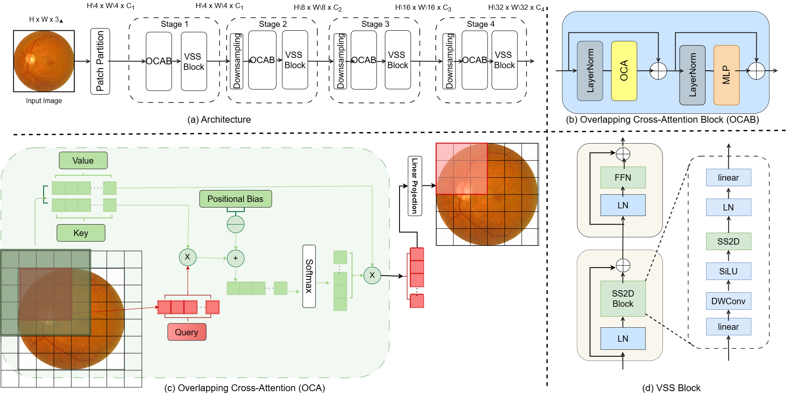
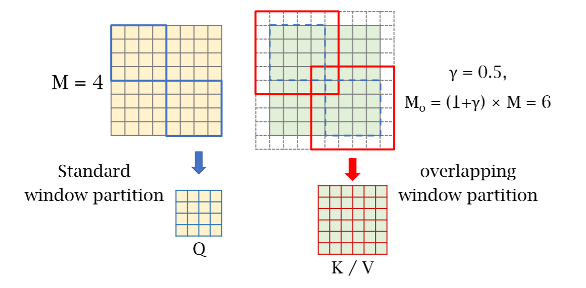
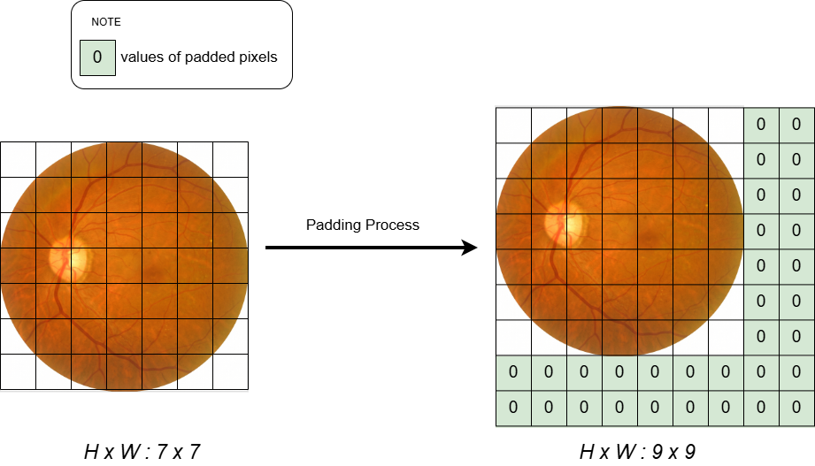
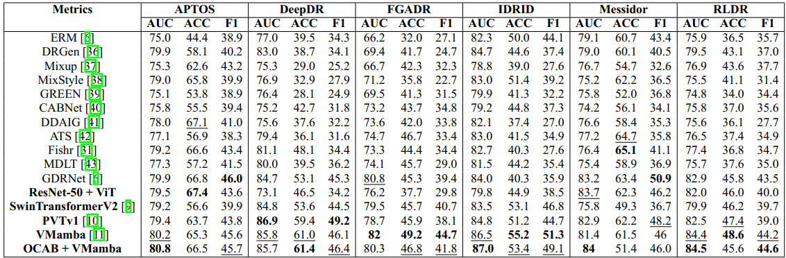
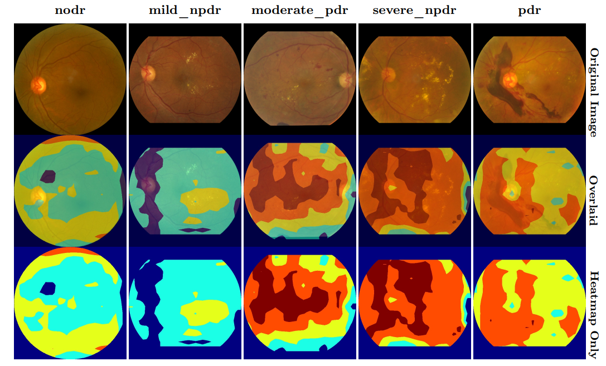
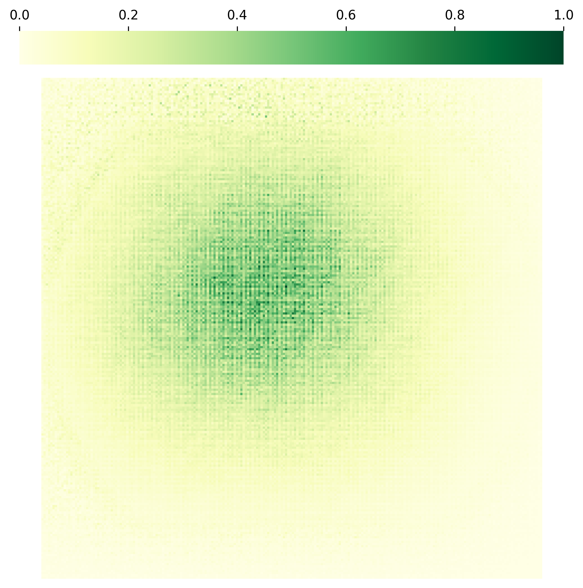
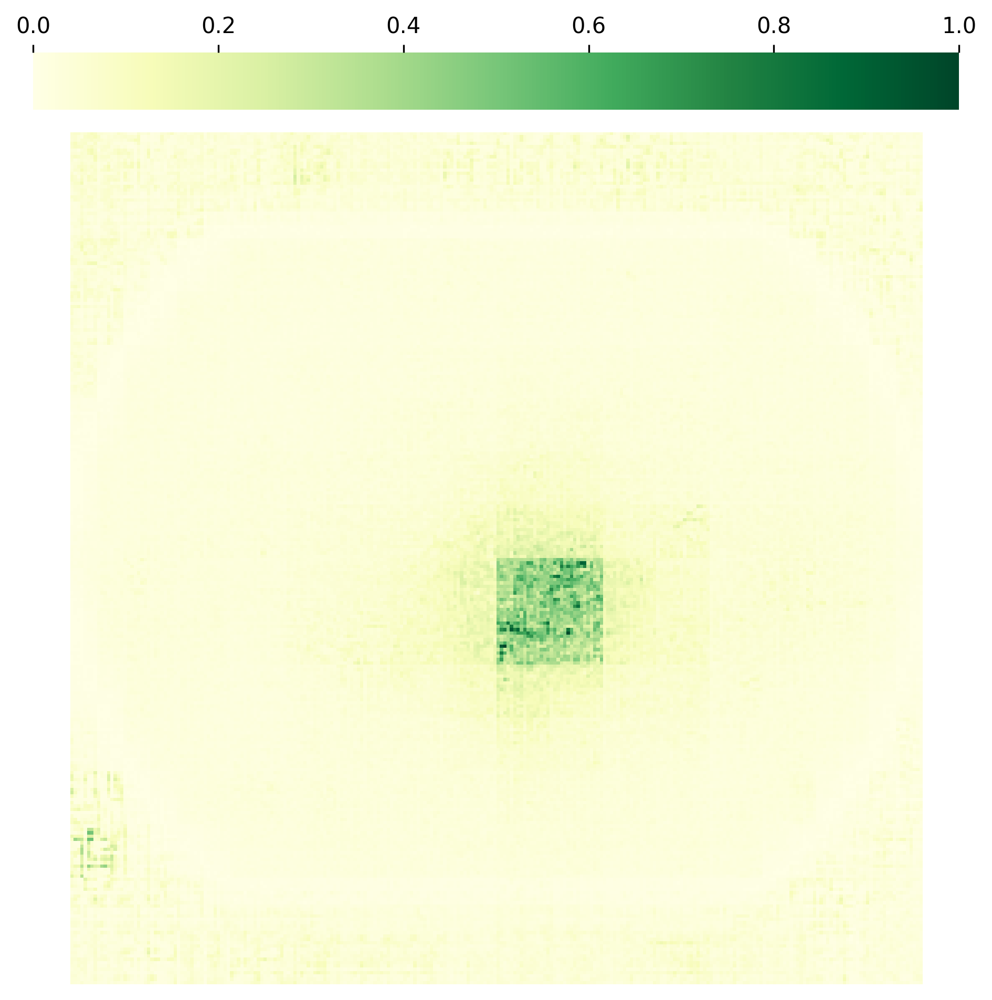
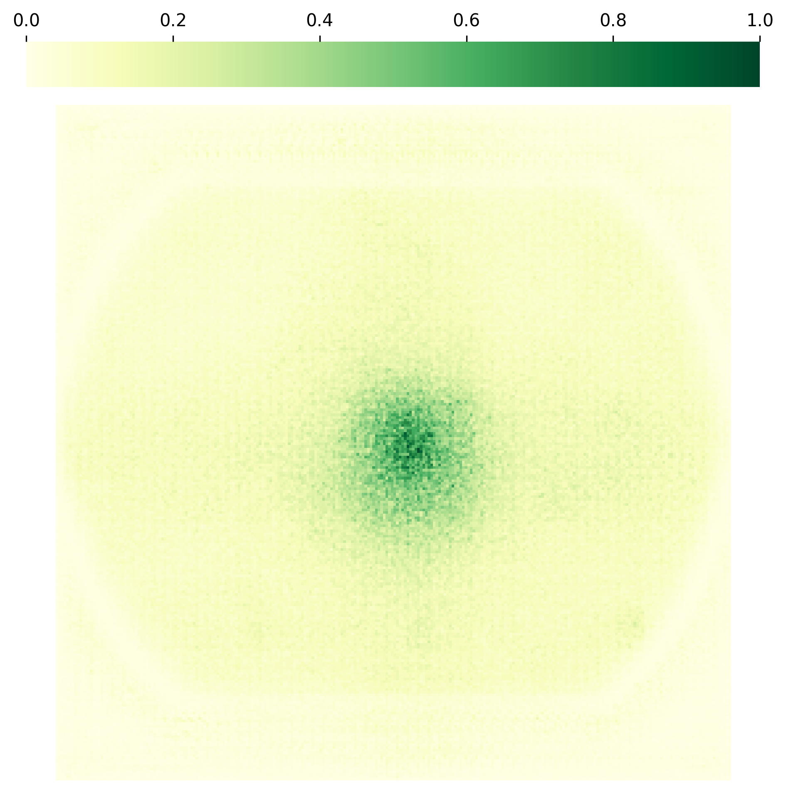
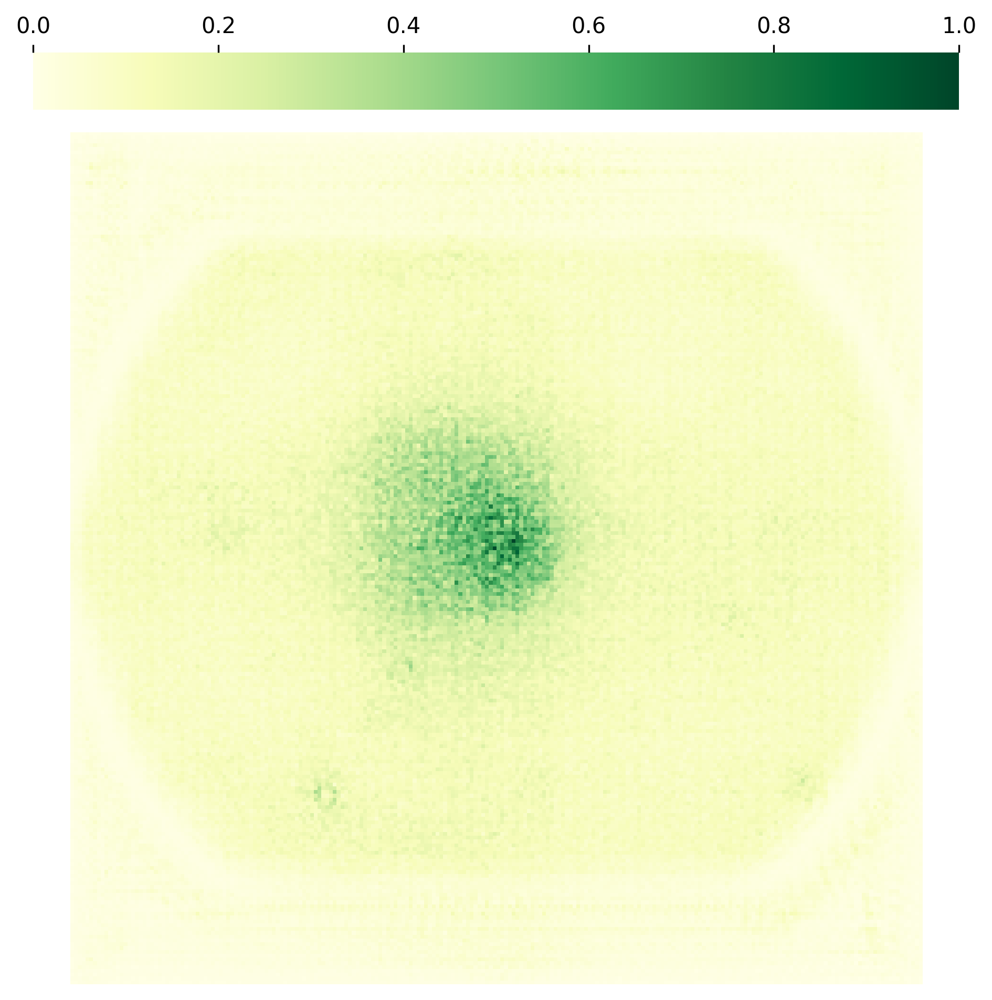

# GDRNet: Towards Generalizable Diabetic Retinopathy Grading in Unseen Domains

## Table of Contents

- [GDRNet: Towards Generalizable Diabetic Retinopathy Grading in Unseen Domains](#GDRNet-towards-generalizable-diabetic-retinopathy-grading-in-unseen-domains)
  - [Table of Contents](#table-of-contents)
  - [News](#news)
  - [Introduction](#introduction)
  - [Getting Started](#getting-started)
    - [Data Preparation](#data-preparation)
    - [Train](#train)
    - [Evaluation](#evaluation)
  - [Citation](#citation)


## Introduction
Diabetic Retinopathy (DR) is a common complication of diabetes and a leading cause of blindness worldwide. Early and accurate grading of its severity is crucial for disease management. 
Although deep learning has shown great potential for automated DR grading, its real-world deployment is still challenging due to distribution shifts among source and target domains. 
<!-- The preliminary evidence presented in the paper suggests the existence of three-fold generalization issues: visual and degradation style shifts, diagnostic pattern diversity, and data imbalance.  -->
To tackle these issues, we propose a novel unified framework named Generalizable Diabetic Retinopathy Grading Network (GDRNet). 
<p align="center">
  
</p>
This project implemented base on DGDR. With this project, we will proposal a hybrid architecture, the model name is OC-Mamba, which is base on VMamba and OCAB (Overlapping Cross Attention Block) and evaluate the model result. Another, we still use a lot of modern model to compare with our proposal model. We evaluate the proposal model by replace each model into backbone of DGDR model. Here is the overview architecture of this model.

<p align="center">
  
</p>

<p align="center">
  
</p>

In the process padding, we used a lot of zero numbers to padding right and bottom of images.
<p align="center">
  
</p>


## Getting Started
These instructions will help you set up the project. 

### Data Preparation

Follow the instructions [here](./GDRBench/README.md).
Your dataset should be organized as: 

```
.
├── images
│   ├── DATASET1
│   │   ├── mild_npdr
│   │   ├── moderate_npdr
│   │   ├── nodr
│   │   ├── pdr
│   │   └── severe_npdr
│   ├── DATASET2
│   │   ├── mild_npdr
│   │   ├── moderate_npdr
│   │   ├── nodr
│   │   ├── pdr
│   │   └── severe_npdr
│   ├── DATASET3
│   │    ...
│   ...  ...
│   
├── masks
│   ├── DATASET1
│   │   ├── mild_npdr
│   │   ├── moderate_npdr
│   │   ├── nodr
│   │   ├── pdr
│   │   └── severe_npdr
│   ├── DATASET2
│   │   ├── mild_npdr
│   │   ├── moderate_npdr
│   │   ├── nodr
│   │   ├── pdr
│   │   └── severe_npdr
│   ├── DATASET3
│   │    ...
│   ...  ...
│   
└── splits
    ├── DATASET1_crossval.txt
    ├── DATASET1_train.txt
    ├── DATASET2_crossval.txt
    ├── DATASET2_train.txt
    ├── DATASET3_crossval.txt
    ├── DATASET3_train.txt
    ...

```

### Train

We provide our GDRNet method and seven other methods for comparison. We also have two experiment settings, DG and ESDG.

Currently, we support other methods including:
- GDRNet
- ERM
- GREEN
- CABNet
- MixupNet
- MixStyleNet

To train the DG setting, you should indicate one dataset as target domain and others as source domains. **PLEASE NOTE** that, DDR and Eyepacs datasets will not be regarded as source domains to train. Run the following command:

```python
python main.py --root YOUR_DATASET_ROOT_PATH
               --algorithm ALGORITHM_NAME
               --dg_mode DG
               --source-domains DATASET2 DATASET3 ...
               --target-domains DATASET1 
               --output YOUR_OUTPUT_DIR
```

To train in the ESDG setting, you should indicate one dataset as source domain and others as target domains. Please run the following command:

```python
python main.py --root YOUR_DATASET_ROOT_PATH
               --algorithm ALGORITHM_NAME
               --dg_mode ESDG
               --source-domains DATASET1
               --target-domains DATASET2 DATASET3 ...
               --output YOUR_OUTPUT_DIR
```

We provide other controllable `args` in `./utils/args.py` to control the training. Besides, you can also specify the hyper-parameters for training by modifying the config files in `./configs/`.

### Evaluation

We evaluate the results during training. You can find and analyze the tensorboard results in `./YOUR_OUTPUT_DIR/`.

### Visualization

We provide a comparison table based on the experimental results of different models.
<p align="center">
  
</p>

We provide a heap map to presentation the model's coverage.
<p align="center">
  
</p>

Finally, we provide some images about receptive field.
<div align="center">
  <div>
    
    
    
    
  </div>

  <div>
    <b>ResNet-50</b>
    &nbsp;&nbsp;&nbsp;&nbsp;&nbsp;&nbsp;&nbsp;&nbsp;
    <b>SwinTransformer V2</b>
    &nbsp;&nbsp;&nbsp;&nbsp;&nbsp;&nbsp;&nbsp;&nbsp;
    <b>VMamba</b>
     &nbsp;&nbsp;&nbsp;&nbsp;&nbsp;&nbsp;&nbsp;&nbsp;
    <b>OC-Mamba</b>
  </div>
</div>

